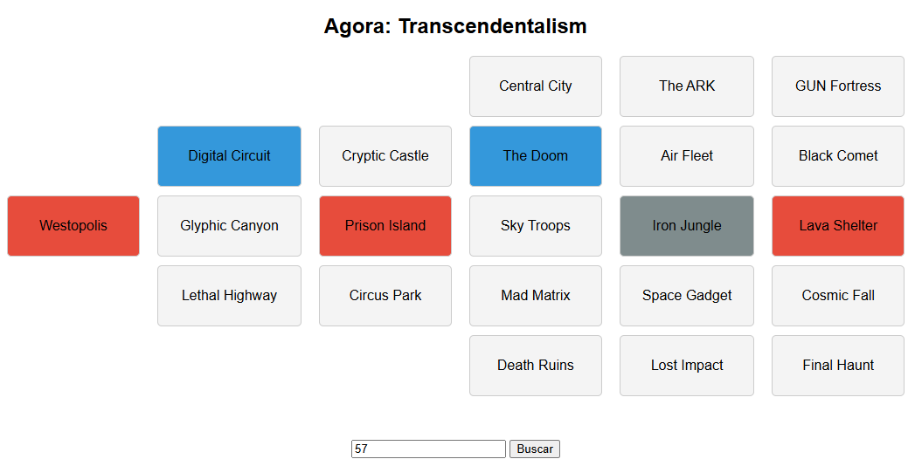

# Shadow The Hedgehog Library API

<p align="center">
  <br />
  
</p>

Este projeto é uma aplicação web que permite consultar rotas específicas e exibi-las visualmente. A aplicação é construída utilizando Flask para o backend e HTML, CSS e JavaScript para o frontend.

## Estrutura do Projeto

```
.
├── _docs/
│   └── assets/
│       └── rotas.png
├── app.py
├── index.html
├── src/
│   └── STH_Library.csv
├── static/
│   ├── images/
│   │   ├── 2MissionEmpty.png
│   │   ├── 3MissionEmpty.png
│   │   ├── AirFleetIcon.png
│   │   ├── BlackCometIcon.png
│   │   ├── Boss.png
│   │   ├── BossComplete.png
│   │   ├── CentralCityIcon.png
│   │   ├── ...
│   ├── script.js
│   └── styles.css
└── requirements.txt
```

### Arquivos e Diretórios

- **_docs/assets/**: Contém a imagem `rotas.png` usada no README.
- **app.py**: Arquivo principal do backend que contém a lógica do servidor Flask.
- **index.html**: Arquivo HTML que define a estrutura da página web.
- **src/STH_Library.csv**: Arquivo CSV que contém os dados das rotas.
- **static/images/**: Diretório que contém as imagens usadas na aplicação.
- **static/script.js**: Arquivo JavaScript que contém a lógica do frontend.
- **static/styles.css**: Arquivo CSS que define o estilo da página web.
- **requirements.txt**: Arquivo que lista as dependências do projeto.

## Funcionalidades

### Backend (Flask)

- **Consultar todas as rotas**: Endpoint `/rotas` que retorna todas as rotas disponíveis no arquivo CSV.
- **Consultar uma rota específica**: Endpoint `/rotas/<int:id>` que retorna os detalhes de uma rota específica com base no ID fornecido.

### Frontend

- **Formulário de busca**: Formulário que permite ao usuário digitar o ID de uma rota e buscar suas informações.
- **Exibição de rotas**: Exibe o nome da rota e destaca as fases da rota com base no tipo (Dark, Normal, Hero).

## Como Executar

1. **Instalar dependências**:
    ```sh
    pip install -r requirements.txt
    ```

2. **Executar o servidor Flask**:
    ```sh
    python app.py
    ```

3. **Abrir o arquivo `index.html`** no navegador para acessar a interface web.

## Exemplo de Uso

1. Digite o ID da rota no campo de busca e clique em "Buscar".
2. A aplicação fará uma requisição ao servidor Flask para obter os detalhes da rota.
3. As informações da rota serão exibidas na página, com destaque para as fases da rota.

## Contato

Para mais informações, entre em contato com o desenvolvedor.

---

Este projeto foi desenvolvido para fins educacionais e demonstra o uso de Flask para criar uma API simples e a integração com um frontend básico em HTML, CSS e JavaScript.